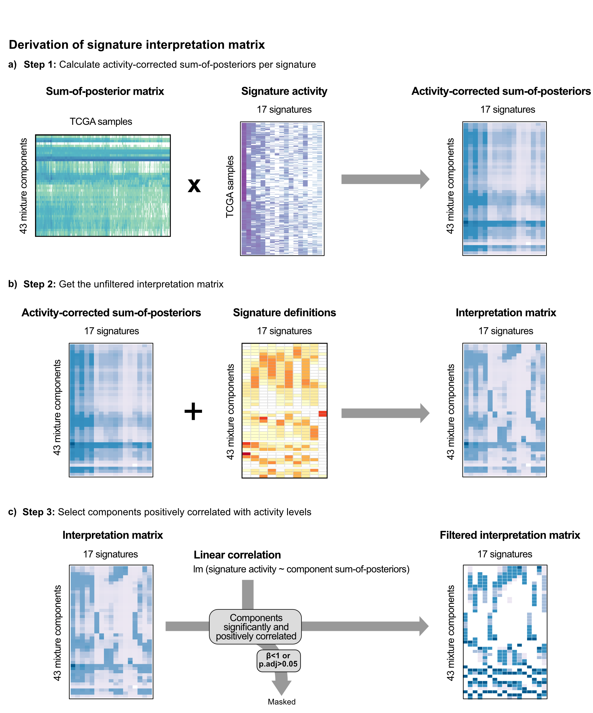

## Procedure to create the signature interpretation matrix

This repository contains the procedure to create the signature interpretation matrix for copy number signatures (Drews et al., 2022)
The three input matrices (sum-of-posterior, signature definitions and signature activities) are included in the data folder. These matrices are derived from ~6000 tumor samples of 33 tumor types as part of the pan-cancer study. The central hub for the study can be found in https://github.com/markowetzlab/Drews2022_CIN_Compendium

## Workflow

## Ongoing research
Our procedure to establish a method to link the signature definitions with the signature activities in order to improve the biological interpretation of signatures is subject of ongoing research. We are working on extend this procedure to other types of mutational signatures. This will be published in a paper in its own right.

## Contact

If you experience any issues or have questions about the code, please open a Github issue with a minimum reproducible example. For questions around collaborations or sensitive patient data, please contact us directly at Florian Markowetz <Florian.Markowetz@cruk.cam.ac.uk> and Geoff Macintyre <gmacintyre@cnio.es>.

## Licence
The contents of this repository are copyright (c) 2022, University of Cambridge and Spanish National Cancer Research Centre (CNIO).

The contents of this repository are published and distributed under the GAP Available Source License v1.0 (ASL). 

The contents of this repository are distributed in the hope that it will be useful for non-commercial academic research, but WITHOUT ANY WARRANTY; without even the implied warranty of MERCHANTABILITY or FITNESS FOR A PARTICULAR PURPOSE.  See the ASL for more details. 

The methods implemented in the code are the subject of pending patent application GB 2114203.9.

Any commercial use of this code is prohibited.
